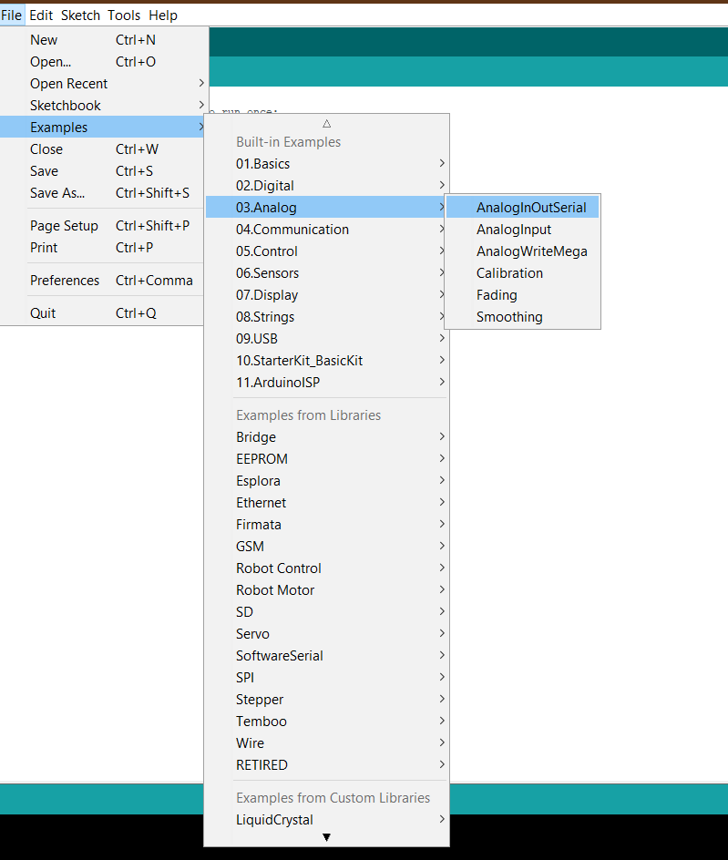

# SENSORS
## 1. TEMPERATURE AND HUMIDITY MODULE
**Introduction**
In this tutorial we will learn how to use a DHT11 Temperature and Humidity Sensor.
It’s accurate enough for most projects that need to keep track of humidity and
temperature readings.
Again we will be using a Library specifically designed for these sensors that will make our
code short and easy to write.

**Components**
- 1 * Arduino Uno board
- 1 * USB cable
- 1 * temp and humidity module
- DuPont wires(Female to Male)

**Principles**

**Experimental Procedures**

**Step 1:**  Connect circuit as shown in the following photo:

As you can see we only need 3 connections to the sensor, since one of the pin is not used.
The connection are : Voltage, Ground and Signal which can be connected to any Analog
Pin on our UNO.

**Step 2:**  Press Ctrl+Shift+I to go to the manage libraries section in your Arduino IDE.Then search for DHT11 in the searchbox.
Install the **DHT sensor library by Adafruit** along with all the dependecies from there:

**Step 3:**   Now go to **Files-->Examples-->DHT Sensor library** and select any one of the two example codes:

**Step 4:**  Now compile the program by clicking on the **Verify** button or by pressing **Ctrl+R**.

**Step 5:**  Now upload the program on you Arduino Board by clicking on the **Upload** button or by pressing **Ctrl+U**.

**Step 6:**  Open the **tools-->Serial Monitor**, then you can see the humidity and temperature.

## 2. PHOTORESISTOR MODULE
**Introduction**
In this tutorial, we will learn how to use photoresistor module.Photo-resistor is very common in our daily life. it is mainly used in intelligent switch so as to bring convenience to our life. At the same time, in our daily life, we also use it in electronic 
design. So in order to use it in a better way, we provide the corresponding modules to help us to use it more conveniently and efficiently.

**Components**

- 1 * Arduino Uno board
- 1 * USB cable
- 1 * photo-resistor module
- DuPont wires(Female to Male)

**Principle**

Photo-resistor module is a photosensitive semiconductor device. In addition to high sensitivity, fast response, spectral characteristics and same r value, it can maintain a high level of stability and reliability in the high temperature, wet and bad environment. It can be  widely apply in the camera, solar garden lamp, lawn lamp, counterfeit detector, quartz clock, music cup, gift boxes, mini night light, street lamp automatic switch and all kinds of electric toys, electric lighting, lamps and lanterns, and other areas of the light automatically on-off controller area.

**Experimental Procedures**

**Step 1:** The corresponding schematic diagram is as follows:

**Step 2:** Connect circuit as shown in the following photo:

**Step 3:** Open the program using **File→Examples→Analog→AnalogInOutSerial**. Change variables according to your circuit connections.

**Step 4:**  Now compile the program by clicking on the **Verify** button or by pressing **Ctrl+R**.

**Step 5:** Now upload the program on your Arduino Board by clicking on the **Upload** button or by pressing **Ctrl+U**.

**Step 6:** Open the **TOOL→Serial Monitor**, and we can see the data as below:

